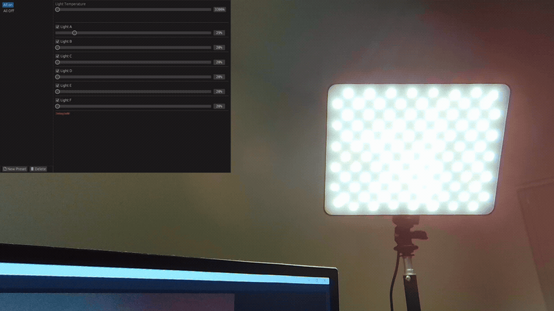
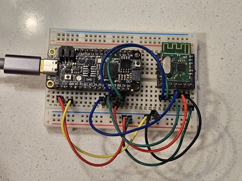

# ViltroxRemote

<table>
  <tr>
    <td></td>
    <td></td>
  </tr>
</table>

I built this back in Dec 2021 when my remote for my Viltrox LED panels broke — and customer service
didn't have an option for me to buy a new remote.

Desktop control for [Viltrox VL-200T](https://viltrox.com/products/viltrox-vl-200-t-video-led-light) LED panels, over the panels' own
2.4 GHz radio protocol — which is undocumented, so the first half of this project was figuring
out what the stock remote says.

Six panels, each with independent power and brightness, plus color temperature. Presets are
saved and recalled from a small desktop GUI; an RP2040 board does the actual transmitting.

```
egui GUI  ──USB CDC──▶  RP2040 firmware  ──SPI──▶  A7105 transceiver  ──2.4 GHz──▶  panels
 (host)     19-byte        (no_std)                 (radio module)
             ASCII
```

---

## How the protocol was recovered

The VL-200T ships with a hand remote and no documentation. The remote's board carries an
**A7105** — a 2.4 GHz FSK transceiver with a public datasheet — so the radio side was a known
quantity; what wasn't known was the payload.

1. **Capture.** A Saleae logic analyzer on the remote's SPI bus, recording the MCU→A7105 traffic
   while pressing buttons in a known order. The raw captures are checked in (`*.sal`, plus CSV
   exports under `a7105_decoder/`).
2. **Decode the bus.** `a7105_decoder` parses those CSVs back into A7105 instructions — strobe
   commands and named register reads/writes — and groups them into bursts separated by >200 ms,
   so each burst lines up with one button press. Output in `a7105_decoder/raw_interpretation.txt`.
3. **Diff the payloads.** With the register writes decoded, the interesting part is what lands in
   `FifoData` (`0x05`). Pressing *brightness up* three times changes one byte, three times;
   toggling group C flips one bit in another. That diffing is written up in
   [`a7105_decoder/protocol.md`](a7105_decoder/protocol.md).
4. **Replay.** `code.py` (CircuitPython) was the first working transmitter — bring up an A7105
   from scratch, replay a captured frame, confirm a real light responds. It ends in a loop that
   chases a brightness wave across three panels, which was the "it actually works" moment. The
   Rust firmware is the same sequence, done properly.

### What the payload turned out to be

A fixed 16-byte frame, no sequence numbers, no acknowledgement — the remote just shouts state at
whoever is listening:

```
 [0]  power    0b01FEDCBA  — one bit per light group, 1 = on
 [1]  brightness, group A  — 20..=100, literally the percentage
 [2]  temperature, group A — 33..=56, kelvin/100 (3300K..5600K)
 [3]  brightness, group B
 [4]  temperature, group B
 ...                        — through group F
 [13] temperature, group F
 [14] brightness, group G   — a seventh group the frame has room for; unused, kept at min
 [15] temperature, group G
```

Every frame carries the **complete** state of all six groups, which is why the firmware keeps a
local model of all six lights and retransmits the whole thing on any change.

Radio settings, also read off the trace: channel 4 (≈2402.001 MHz), ID `57 5A 52 46`, 4-byte
preamble, CRC on, data whitening and FEC off, "easy FIFO" mode with a 16-byte length.

---

## Layout

| Path | What it is |
|---|---|
| `vl200t_controller_gui/` | Desktop app (egui/eframe). Presets, six power/brightness pairs, one temperature slider. |
| `vl200t_controller/` | `no_std` firmware for an Adafruit Feather RP2040. USB serial in, A7105 driver out. |
| `a7105_decoder/` | Offline tool that turns Saleae SPI captures into readable A7105 instructions. |
| `a7105_decoder/protocol.md` | The reverse-engineering notes — the payload diffs, byte by byte. |
| `code.py` | CircuitPython prototype: first working A7105 bring-up and frame replay. |
| `*.sal`, `a7105_decoder/*.csv` | Saleae captures and their CSV exports. |

## The layers

Each hop is deliberately dumber than the one above it.

**GUI → firmware** is 19 ASCII bytes, one line per state change: six groups × `(power,
brightness, temperature)` plus a `' '` terminator. Power is `'0'`/`'1'`; brightness and
temperature are offset from `'.'` (so `'.'` is 20% and 3300 K). Everything stays printable, which
means the firmware can be driven from any serial terminal — useful when the GUI is the thing
you're debugging. The GUI rate-limits to one frame per 100 ms and only sends on an actual change.

**Firmware** keeps `[Light; 6]`, applies incoming commands, and transmits only if the state
actually differs — so holding a slider doesn't flood the radio. Reads land in a 19-byte
`heapless::HistoryBuffer`, and `process_command` rotates the ring around the `' '` terminator, so
a partial USB read never desynchronizes the stream. Each change is transmitted twice; the
protocol has no acknowledgement, so redundancy is the only error correction available.

**`Transceiver`** owns the A7105: full register init from reset, IF-filter and VCO calibration
(both checked, both fatal if they fail), then per-frame FIFO write → TX strobe → wait on the
module's WTR line → back to standby.

Feedback without a screen: the onboard NeoPixel is white when initialized, red on transceiver
init failure, green if the A7105 stops answering with its ID, blue on a USB error. D13 toggles
on every transmitted change, so you can see traffic at a glance.

---

## Hardware

- Adafruit Feather RP2040
- A7105 module (2.4 GHz), on SPI0

| Feather pin | A7105 |
|---|---|
| `SCK` / `MO` / `MI` | `SCK` / `SDIO` / `GPIO1` (configured as MISO) |
| `RX` | `CS` |
| `TX` | `GPIO2`, configured as WTR (transmit-complete) |

The A7105's GPIO1/GPIO2 are set to 4-wire SPI and WTR respectively during init, so a fresh module
must be brought up by `run_init` before the bus behaves as the table describes.

## Building

The workspace mixes host and embedded targets, so build per crate rather than at the root.

```sh
# Firmware — needs the target and elf2uf2-rs; the runner flashes a Feather in bootloader mode
rustup target add thumbv6m-none-eabi
cargo install elf2uf2-rs
cargo run -p vl200t_controller --target thumbv6m-none-eabi --release

# Desktop GUI (finds the board by USB VID:PID 1d50:6173)
cargo run -p vl200t_controller_gui --release

# Decoder — reads ./rust.csv, so run it from its own directory
cd a7105_decoder && cargo run
```

## Known rough edges

This is a personal project that stopped when the lights worked. Left as-is, honestly:

- **One temperature for all six panels.** The protocol carries a per-group temperature byte; the
  GUI exposes a single slider and writes the same value to all six. No reason beyond not needing it.
- **The decoder is a workbench tool.** Hardcoded input path, and the list of expected button
  labels is edited in source per capture. It was run interactively while reading traces.
- **`vl200t_controller_gui/src/lib.rs`** holds a `Device`/`LightSettings` pair that predates the
  preset model in `app.rs` and is no longer used.
- **Timing constants in `set_lights`** were measured off the original remote's trace and are
  carried over verbatim rather than derived from the datasheet.
- Errors in the GUI's send path `unwrap()`. Unplugging the board mid-session panics.

## References

- A7105 datasheet (AMICCOM) — register map and calibration sequence
- [`rp-hal`](https://github.com/rp-rs/rp-hal) / `adafruit-feather-rp2040` BSP
- [`egui`](https://github.com/emilk/egui) / `eframe`

---

*Only this README was written with AI assistance, in 2026, from the capture files and protocol
notes already in this repo. The reverse engineering, the firmware, the GUI, and the decoder are
my own work from Dec 2021.*
